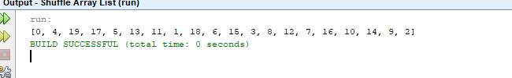

# Project Title
Shuffle Array List 19.8

One Paragraph of project description goes here

## Example Output

This image will display as your example output. Name the image README.jpg in your project folder.



## Analysis Steps

Well it was pretty straight forward. I just had to load an array with integers 
and create a method to to randomize it's pattern.

### Design

One for loop to load the array then another to Shuffle it within a 
specified method to do so. with a random index used to shuffle the Array. 

```
Give examples
```

### Testing

First the for loop was constructed to load the Array.so once that tested positive I went on to the second
the second loop was more difficult but after I got past the errors it worked out fine

```
Give the example
```

And repeat

```
until finished
```

End with an example of getting some data out of the system or using it for a little demo

## Notes

Explain any issues or testing instructions.

## Do not change content below this line
## Adapted from a README Built With

* [Dropwizard](http://www.dropwizard.io/1.0.2/docs/) - The web framework used
* [Maven](https://maven.apache.org/) - Dependency Management
* [ROME](https://rometools.github.io/rome/) - Used to generate RSS Feeds

## Contributing

Please read [CONTRIBUTING.md](https://gist.github.com/PurpleBooth/b24679402957c63ec426) for details on our code of conduct, and the process for submitting pull requests to us.

## Versioning

We use [SemVer](http://semver.org/) for versioning. For the versions available, see the [tags on this repository](https://github.com/your/project/tags). 

## Authors

Alex Hansen

See also the list of [contributors](https://github.com/your/project/contributors) who participated in this project.

## License

This project is licensed under the MIT License - see the [LICENSE.md](LICENSE.md) file for details

## Acknowledgments

* Hat tip to anyone who's code was used
* Inspiration
* etc
